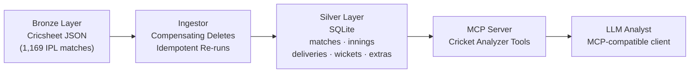

# WicketGraph: Agentic Cricket Intelligence with MCP

> **Status:** Phase 1 complete (Bronze → Silver pipeline). Phase 2 in progress (MCP analyzers).

WicketGraph is a structured cricket intelligence platform that transforms raw Cricsheet ball-by-ball JSON data into a normalized, analytically queryable SQLite layer, then exposes that layer through a custom MCP server so that LLM clients can perform analyst-style reasoning over structured cricket data. The system is designed from the ground up for agentic use: every analytical capability is a typed, isolated tool that can be invoked directly via MCP or later orchestrated through a LangGraph workflow for multi-step cricket reasoning.

---

## The Problem

Cricsheet's ball-by-ball JSON is deeply nested, event-driven, and structurally inconsistent across matches — optional fields, ragged innings arrays, multi-wicket deliveries, and varied extras schemas make naive parsing fragile. More critically, raw event data is not the right shape for cricket-aware analytical reasoning. Answering questions like *"how did this bowler set up the batter before dismissal?"* or *"which spell shifted match momentum?"* requires normalized, grain-correct relational data, not raw JSON traversal. The gap between raw delivery events and cricket-grounded LLM reasoning is a data engineering problem, not just a prompting one.

---

## The Solution

WicketGraph closes that gap in three layers:

1. **Silver Layer (SQLite)** — a normalized, validated relational schema built from Cricsheet JSON. Grain-checked at the delivery level. Incrementally updatable. Structured to preserve analytically load-bearing cricket distinctions: over phase, dismissal type, bowling style, innings context.

2. **High-Integrity Ingestion Pipeline** — a transactional ingestor with compensating deletes to prevent partial commits. Tracks ingestion state per file so re-runs are safe and idempotent. Includes a built-in verification report with null checks, grain checks, and FK validation.

3. **MCP Server (in progress)** — exposes specialized cricket analyzers as MCP tools. Any MCP-compatible LLM client can invoke these tools directly to query match patterns, retrieve batter/bowler matchups, and generate cricket-grounded explanations without writing SQL.

---

## Engineering Highlights

- **Data Integrity:** Normalized 1,169 IPL matches and 278,205+ deliveries from deeply nested JSON into a validated, grain-checked schema. Zero duplicate `(match_id, innings_number, over, ball)` combinations across the full dataset.

- **Atomic Pipelines:** `pandas.DataFrame.to_sql()` commits rows incrementally and cannot be rolled back. To handle this, the ingestor implements a compensating-delete strategy: on any failure mid-write, all rows for that `match_id` are explicitly removed across all silver tables before the failure is logged. This ensures no partial match data survives a failed ingest.

- **Agentic Interface:** The entire analytical layer is being built around the Model Context Protocol (MCP). Analyzers are designed as MCP tools from the start — typed inputs, explicit outputs, no side effects — so LLM clients can query cricket data without any custom glue code.

- **Tool-First Design:** Extraction logic (`extractor.py`) and orchestration logic (`ingest_all.py`) are decoupled. The ingestor accepts a `SourceAdapter` protocol, making it testable and extensible to other data sources. Analyzers will follow the same pattern: standalone typed functions that can be registered as MCP tools or wrapped as LangGraph nodes.

---

## Architecture



---

## Current Project Status

| Phase | Status | Description |
|---|---|---|
| Phase 1: Ingestion Foundation | **Complete** | Bronze → Silver pipeline; 1,169 matches; validated silver schema |
| Phase 2: Analyzers + MCP Server | **In progress** | Typed cricket analyzers registered as MCP tools |
| Phase 3: LangGraph Orchestration | **Planned** | Multi-step reasoning over match sequences; contextual research inputs |

**Phase 1 Silver Layer — validated counts:**

| Table | Rows |
|---|---|
| `matches` | 1,169 |
| `innings` | 2,365 |
| `deliveries` | 278,205 |
| `wickets` | 13,823 |
| `extras` | 15,161 |
| `ingestion_log` | 1,169 (all `success`) |

**Phase 2 analyzer targets** (being built now):
- Bowler setup sequence before dismissal
- Batter scoring patterns in final 6–12 balls faced
- Momentum-shifting overs and spells
- Batter performance vs pace vs spin, by phase and length

---

## Repository Structure

```
WicketGraph/
├── data/
│   ├── 01_bronze_cricsheet/      # Raw Cricsheet JSON files (one per match)
│   └── 02_silver_tables/
│       └── silver.db             # Normalized SQLite silver layer
├── src/
│   ├── extractor.py              # Single-match JSON → 5 DataFrames
│   └── ingest_all.py             # Bulk orchestrator with compensating deletes + verification
└── CLAUDE.md                     # Project spec and architecture principles
```

---

## Running the Project

**Prerequisites:** Python 3.12+

```bash
# Install dependencies
pip install -r requirements.txt

# Run the full ingestion pipeline (incremental — safe to re-run)
cd src
python ingest_all.py

# The script will:
# 1. Discover all JSON files in data/01_bronze_cricsheet/
# 2. Skip files already successfully processed
# 3. Write normalized rows to data/02_silver_tables/silver.db
# 4. Print a verification report (row counts, null checks, grain check, FK check)
```

**MCP tooling** is the current build stage. The MCP server will be runnable as a local stdio server compatible with Claude Desktop and other MCP clients.

---

## Why This Project Is Interesting

This is not a sports project with a cricket theme. It is a demonstration of several engineering concerns that appear together in serious data + AI systems:

- **Data Engineering** — parsing heterogeneous, nested JSON at scale with explicit schema validation
- **Schema Design** — separating raw, normalized, and feature-engineered layers; preserving analytical grain
- **Idempotent Ingestion** — safe re-runs, incremental processing, compensating-delete transactional correctness
- **MCP / LLM Tooling** — designing analytical capabilities as first-class agentic tools, not ad hoc scripts
- **Domain-Aware Analytics** — cricket semantics (over phases, dismissal types, bowling styles) are treated as load-bearing distinctions, not noise to be flattened

The architecture is intentionally layered so that each concern — extraction, normalization, analysis, tool exposure, orchestration — can be developed, tested, and replaced independently.

---

## Roadmap

- [ ] Implement Phase 2 cricket analyzers (bowler setup, batter patterns, momentum detection, pace vs spin splits)
- [ ] Register analyzers as MCP tools via the MCP Python SDK
- [ ] Build and test MCP server with a local LLM client (Claude Desktop)
- [ ] Add over-phase tagging (powerplay / middle / death) to deliveries
- [ ] Phase 3: LangGraph orchestration for multi-step match reasoning
- [ ] Extend silver layer to other Cricsheet formats (Test, ODI)
