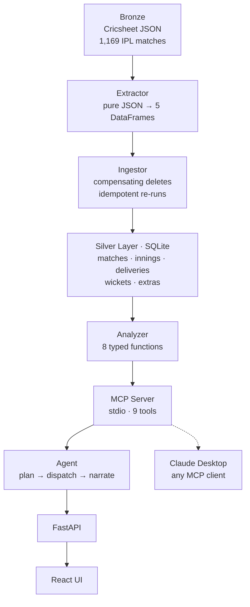

# WicketGraph: Agentic Cricket Intelligence with MCP

> **Status:** Bronze → Silver ingestion, the analyzer engine, the MCP server, and the served API + UI are all live. Orchestration is partially built.

WicketGraph transforms raw Cricsheet ball-by-ball JSON into a normalized, analytically queryable SQLite layer, exposes that layer through a custom MCP server, and lets LLM clients perform analyst-style reasoning over structured cricket data. Every analytical capability is a typed, isolated tool — invocable directly over MCP, or orchestrated by an agent behind an HTTP API.

---

## The Problem

Cricsheet's ball-by-ball JSON is deeply nested, event-driven, and structurally inconsistent across matches — optional fields, ragged innings arrays, multi-wicket deliveries, and varied extras schemas make naive parsing fragile. More critically, raw event data is not the right shape for cricket-aware analytical reasoning. Answering *"how did this bowler set up the batter before dismissal?"* or *"which spell shifted match momentum?"* requires normalized, grain-correct relational data, not raw JSON traversal. The gap between raw delivery events and cricket-grounded LLM reasoning is a data engineering problem, not just a prompting one.

## The Solution

1. **Silver Layer (SQLite)** — a normalized, validated relational schema built from Cricsheet JSON. Grain-checked at the delivery level, incrementally updatable, and structured to preserve analytically load-bearing distinctions: over phase, dismissal type, bowling style, innings context.

2. **High-Integrity Ingestion** — a transactional ingestor with compensating deletes to prevent partial commits, per-file ingestion state so re-runs are idempotent, and a verification report covering null checks, grain checks, FK validation, and index presence.

3. **Analyzer + MCP Server** — eight typed cricket analyzers registered as MCP tools. Any MCP-compatible LLM client can invoke them directly, without writing SQL.

4. **Agent + Serving** — an MCP-connected agent plans which tools to call and composes a briefing; FastAPI serves it; a React SPA renders it with the pipeline trace visible.

---

## Architecture


```mermaid
flowchart TB
    A["Bronze<br/>Cricsheet JSON<br/>1,169 IPL matches"]
    B["Extractor<br/>pure JSON → 5 DataFrames"]
    C["Ingestor<br/>compensating deletes<br/>idempotent re-runs"]
    D["Silver Layer · SQLite<br/>matches · innings · deliveries<br/>wickets · extras"]
    E["Analyzer<br/>8 typed functions"]
    F["MCP Server<br/>stdio · 9 tools"]
    G["Agent<br/>plan → dispatch → narrate"]
    H["FastAPI"]
    I["React UI"]

    A --> B --> C --> D --> E --> F --> G --> H --> I
    F -.-> J["Claude Desktop<br/>any MCP client"]
```

The chain is strictly one-directional. `db_path` is an argument to every analyzer function, never a global — which is why the same code serves stdio MCP, the HTTP API, and the test suite with no duplicated logic.

---

## Engineering Highlights

**Data integrity.** 1,169 matches and 278,205 deliveries normalized from deeply nested JSON into a validated, grain-checked schema. Zero duplicate `(match_id, innings_number, over, ball)` combinations.

**Atomic pipelines.** `pandas.to_sql()` commits incrementally and cannot be rolled back. The ingestor compensates instead: on any mid-write failure, every row for that `match_id` is deleted across all silver tables before the failure is logged. No partial match data survives a failed ingest.

**Indexed for the access pattern that matters.** `deliveries.ball` is a positional index including illegal deliveries, so legality must be recovered by a correlated anti-join against `extras`. Unindexed, that costs **20.17s** for a single batter lookup; with the covering indexes in `src/db.py`, **0.24s** — an 83x difference. `ingest_all()` applies them idempotently and `verify()` asserts they exist.

**Cricket semantics are never flattened.** Over phase, dismissal kind, bowling style, and innings context are preserved end to end. Two deliberately distinct dismissal constants: run outs count toward a batter's average but are never credited to a bowler or a bowling style.

**The LLM narrates, it never computes.** Models receive tool output and are instructed to use only supplied facts. If no API key is configured, the endpoint returns a deterministic rule-based card rather than failing.

---

## Quickstart

```bash
pip install -r requirements-api.txt

python src/ingest_all.py        # ingest + verify + ensure indexes (idempotent)
python -m pytest tests/ -q      # 68 tests
python src/mcp_server.py        # stdio MCP server for Claude Desktop
```

### Run the full stack

```bash
cp .env.example .env            # add OPENAI_API_KEY for AI narration (optional)
docker compose up -d --build
```

| Service | URL |
|---|---|
| UI | http://localhost:5273 |
| API | http://localhost:8100 |
| Health | http://localhost:8100/health |

```bash
curl -X POST http://localhost:8100/briefing \
  -H "Content-Type: application/json" \
  -d '{"question":"brief me on Kohli vs Bumrah"}'
```

> **Ports.** 8100/5273 are used instead of 8000/5173, which commonly clash with other local projects. Override with `API_PORT` / `UI_PORT` in `.env`.
>
> **`VITE_API_BASE` is a build argument, not a runtime variable.** Vite inlines `import.meta.env` at compile time, so changing it requires `docker compose build ui`.
>
> **`mcp` must stay `<2.0`.** Version 2.x removed `RequestContext`, which `langchain-mcp-adapters` imports at module load.

---

## MCP Tools

| Tool | Returns |
|---|---|
| `resolve_player` | exact stored name for a loosely-typed one, with confidence + alternatives |
| `batter_career_stats` | career runs, SR, average, boundaries, dot % |
| `batter_phase_split` | powerplay / middle / death breakdown |
| `batter_vs_bowling_type` | pace/spin × phase matrix, plus an explicit `unknown` row |
| `bowler_wicket_profile` | wickets by phase and kind, economy, bowling SR |
| `bowler_setup_sequence` | ball-by-ball sequences before each dismissal |
| `head_to_head` | full matchup with phase splits |
| `match_momentum` | over-by-over runs/wickets with momentum flags |
| `milestone_tracker` | progress toward a runs goal in a contextual filter |

### Use from Claude Desktop

```json
{
  "mcpServers": {
    "wicketgraph": {
      "command": "python",
      "args": ["/absolute/path/to/WicketGraph/src/mcp_server.py"]
    }
  }
}
```

---

## Cricket Semantics

**Over phases** (0-indexed as stored):

| phase | overs (0-idx) | overs (spoken) |
|---|---|---|
| powerplay | 0–5 | 1–6 |
| middle | 6–14 | 7–15 |
| death | 15–19 | 16–20 |

**Dismissals.** `BOWLER_WICKET_KINDS` is credited to the bowler and excludes run outs. `BATTER_DISMISSAL_KINDS` is the batting-average denominator and includes them, excluding only `retired hurt`.

**Extras.** Only wides are excluded from balls faced. A no-ball *is* a ball faced (cricket-correct) and counts toward the bowler's economy.

**Player names.** Analyzers match names exactly, so human input must be resolved first via `resolve_player_name()` / the `resolve_player` MCP tool. It matches on surname, then given-name initial, then how many balls the player actually faced or bowled — because "Sharma" is ambiguous across 12+ players. `role="batter"|"bowler"` narrows further. Handles surnames alone, full names, nicknames, lowercase, accents, and misspellings: `Starc`→`MA Starc`, `rohit`→`RG Sharma`, `Kohly`→`V Kohli`.

**Bowling style.** Cricsheet supplies no style field, so `analyzer.BOWLER_STYLES` maps 191 bowlers covering **84.4%** of all deliveries. The remainder are labelled `"unknown"` and surfaced as their own row rather than silently folded into pace or spin. `bowling_style_coverage(db_path)` reports the gap; `extra_styles` injects corrections at runtime.

---

## Project Status

| Phase | Status | Description |
|---|---|---|
| 1. Ingestion foundation | **Complete** | Bronze → Silver; 1,169 matches; validated schema |
| 2a. Analyzer engine | **Complete** | 8 typed functions + a style-coverage tool |
| 2b. MCP server | **Complete** | 9 tools over stdio (8 analyzers + resolve_player) |
| 2c. Briefing UI | **Complete** | FastAPI + React (replaced the planned Streamlit app) |
| 3. Orchestration | **Partial** | Linear agent live; StateGraph compiled but unused |
| 4. Deployment | **Complete** | Docker Compose + Kubernetes manifests |

## Known Limits

- **No chasing/defending or batting-position context.** The extractor drops `teams`, `toss`, `event`, and `outcome.by`, so insights conditioned on match situation are not yet answerable. Extending the extractor is the prerequisite.
- **Two MCP servers exist.** `src/server.py` is an earlier prototype with divergent dismissal filtering. Prefer `src/mcp_server.py`.
- **Tool planning is keyword matching**, not model-driven. (Player-name resolution *is* data-driven — see above.)
- **No gold layer.** `data/03_gold_features/` is empty.

## Layout

```
src/
  extractor.py        pure JSON → DataFrames
  ingest_all.py       orchestration, atomicity, verification
  db.py               connection helper + SILVER_INDEXES
  analyzer.py         8 typed analytical functions
  mcp_server.py       FastMCP stdio server (current)
  server.py           earlier single-tool prototype (legacy)
  analyzers/          legacy analyzer module
  langgraph_agent.py  MCP client, planner, narrator
  api/app.py          FastAPI
frontend/             React + Vite + nginx
k8s/                  namespace, config, deployments, HPA
tests/                35 tests
```
